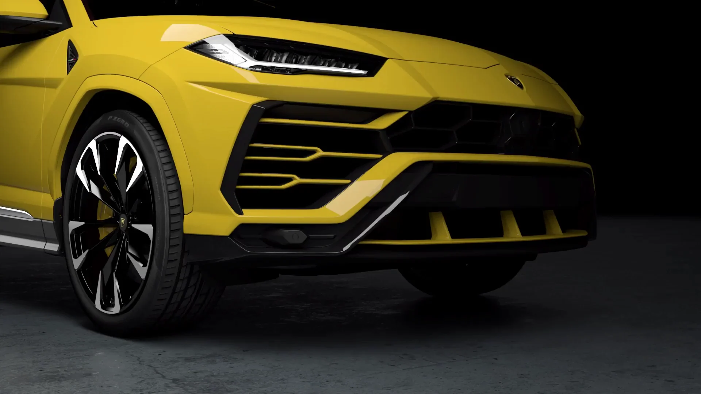
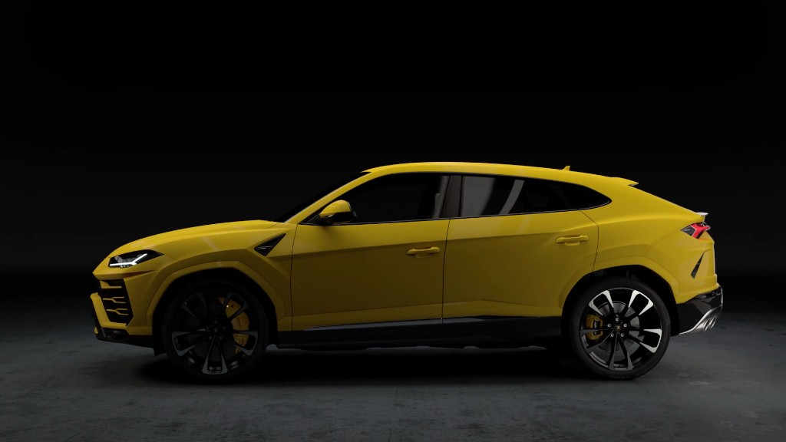
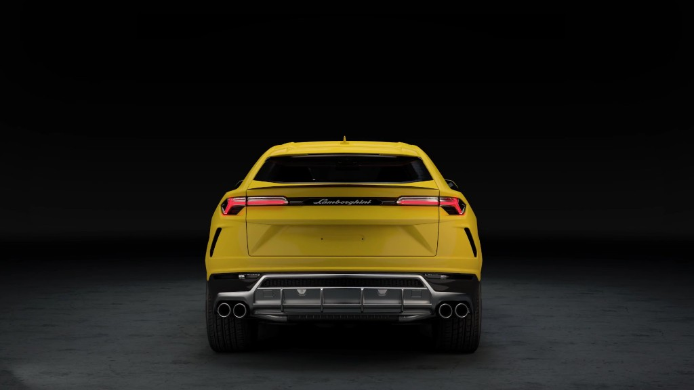
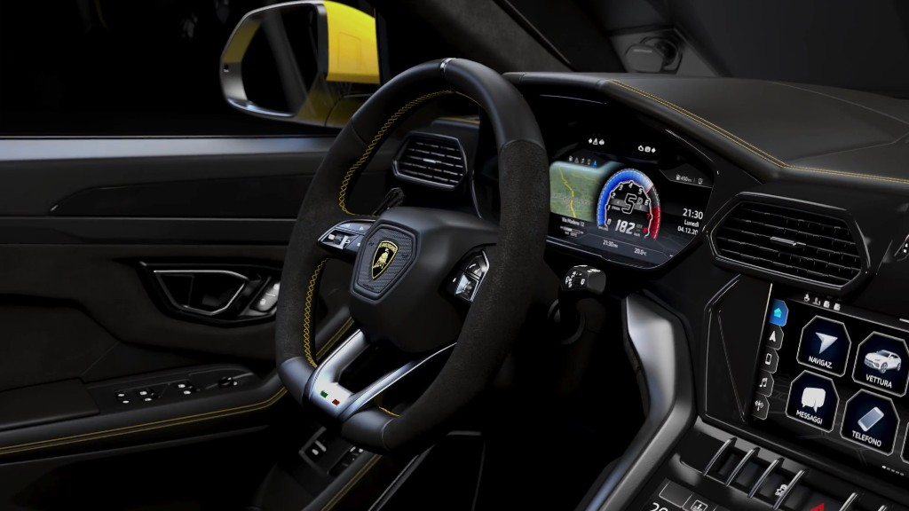

  

<h1 align="center">Lamborghini Urus</h1>

  Суперспортивный внедорожник 
  <em>Urus S · Giallo Inti</em>

---

Одностраничный лендинг модели. Страница знакомит с автомобилем и ведёт к записи на персональный просмотр.

Первый экран — видео. Двести кадров сменяются по мере прокрутки: от фасада к силуэту. По ходу появляются главы о модели, бездорожье, динамике, режимах движения и форме кузова.

Ниже — описание, фотографии и то, что получает владелец. Urus показан как один автомобиль для города, трассы и движения вне асфальта.

  
  &nbsp;
  
  &nbsp;
  

  <table>
    <tr>
      <th align="center">Мощность</th>
      <th align="center">Разгон 0–100 км/ч</th>
      <th align="center">Салон</th>
    </tr>
    <tr>
      <td align="center"><b>666 л. с.</b></td>
      <td align="center"><b>3,5 с</b></td>
      <td align="center"><b>5 мест</b></td>
    </tr>
  </table>

В конце страницы — заявка: имя, телефон, комментарий. Цель — привести человека посмотреть автомобиль лично.
